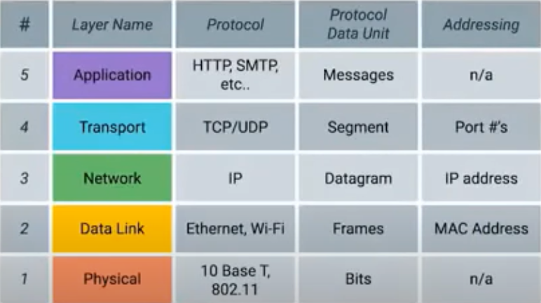
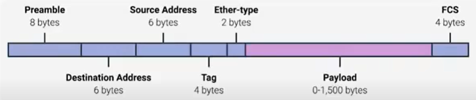

# Computer networking
---------------
## Definition

The overall scope of how computers communicate with each other.

## Protocol

The rules and standards computers follow to communiacte properly with each other. 

There are several models such as:
- TCP/ IP model
- OSI model

## TCP/ IP FIVE LAYER MODEL

### Basics of networking devices

#### Cables
- **Copper**: 
  Binary codes are transmitted as voltage changes across these cables
  Eg: Cat5, Cat5e, Cat6
- **Fibre**: 
  Uses pulses of light to transmit binary code
  Faster, but fragile, and long distance

#### Hubs and switches
Allows many devices to connect with each other unlike cables which suports only end-to-end. 
Fowrards information with a network (LAN)

- **Hub**  
  Sends information to all the devices connected  
  Sometimes causes **Collision domain**  
  Obsolete  
- **Switch**  
  Sends information to only the requesting device  
  Is a part of data link layer (can detect ethernet)  

#### Routers  
A device that knows how to forward data between independent networks.    
A network layer device. Knows IP.    
A home or local network has *Home router* which forwards the data to the ISP which has *Core routers* which are much more complicated and handles more traffic as it interacts with a lot of Home routers.     
Routers share data with each other using **Border Gateway Protocol (BGP)** which lets them learn about the most optimal paths to forward traffic.    

#### Servers and clients
A node refers to the devices which are present in a network.  
A node can be either a server or a client. The terminology depends on it's purpose of existence.   

- **Server**:  
  provides information to the requesting devices
- **Client**:  
  gets information from a server  

### Physical layer

- Bit  
  The smallest representation of data that a computer can understand; it's a one or zero.  
- Modulation  
  A way of varying the voltage of charge moving accross the cable  

#### Twisted pair cable

- Duplex communication  
  The concept that information can flow in both directions across the cable. Ex: Phone call.  
- Simplex communication  
  Unidrectional flow of information. Ex: Baby monitor.  
- Full duplex  
  Both client and server simultaneously share info with each other.  
- Half duplex  
  Client and server share info alternatively with each other.  

#### Network Ports and Patch panels

Twisted pair network cables end in plugs.   

- Network ports  
  Directly connected to the devices in the network.  

### Data link layer

Uses Ethernet protocol.  Ethernet protocol controls the transmission of data between nodes. It uses two things to do this: CSMA/ CD and HMAC.
- **CSMA/CD**  
  Used to determine when the communications are clear, and when a devices is free to transmit data. (because if two nodes are to send data at the same time, they will collide).   
  For this, when a collision occurs, the nodes stop sending data and resume sharing after a random interval of time. 
  
- **MAC address**  
  A globally unique identifier attached to an individual network interface. It's a 48 bit number normally represented by six groupings of two exadecimal numbers.  
  Ethernet uses MAC address to ensure that the data it sends has both an address fro the machine that sent the transmission, as well as the one the transimission was intended for.

#### Unicast, Multicast, and Broadcast

**Unicast**: Trasnmission meant for just one recieving address.  
**Multicast**: Information is send to all the devices. But it accepted or discarded by the device based on some criteria.  
**Broadcast**: Information is sent to every single device.   

#### Dissecting the ethernet frame

  

