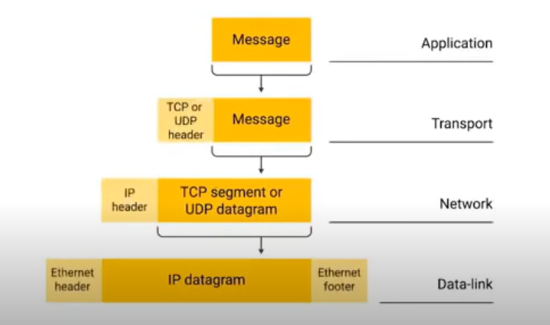
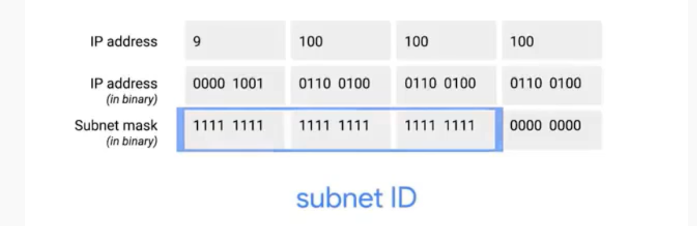

# Computer networking
---------------
## Definition

The overall scope of how computers communicate with each other.

## Protocol

The rules and standards computers follow to communiacte properly with each other. 

There are several models such as:
- TCP/ IP model
- OSI model

## TCP/ IP FIVE LAYER MODEL

### Basics of networking devices

#### Cables
- **Copper**: 
  Binary codes are transmitted as voltage changes across these cables
  Eg: Cat5, Cat5e, Cat6
- **Fibre**: 
  Uses pulses of light to transmit binary code
  Faster, but fragile, and long distance

#### Hubs and switches
Allows many devices to connect with each other unlike cables which suports only end-to-end. 
Fowrards information with a network (LAN)

- **Hub**  
  Sends information to all the devices connected  
  Sometimes causes **Collision domain**  
  Obsolete  
- **Switch**  
  Sends information to only the requesting device  
  Is a part of data link layer (can detect ethernet)  

#### Routers  
A device that knows how to forward data between independent networks.    
A network layer device. Knows IP.    
A home or local network has *Home router* which forwards the data to the ISP which has *Core routers* which are much more complicated and handles more traffic as it interacts with a lot of Home routers.     
Routers share data with each other using **Border Gateway Protocol (BGP)** which lets them learn about the most optimal paths to forward traffic.    

#### Servers and clients
A node refers to the devices which are present in a network.  
A node can be either a server or a client. The terminology depends on it's purpose of existence.   

- **Server**:  
  provides information to the requesting devices
- **Client**:  
  gets information from a server  

### 1. Physical layer

- Bit  
  The smallest representation of data that a computer can understand; it's a one or zero.  
- Modulation  
  A way of varying the voltage of charge moving accross the cable  

#### Twisted pair cable

- Duplex communication  
  The concept that information can flow in both directions across the cable. Ex: Phone call.  
- Simplex communication  
  Unidrectional flow of information. Ex: Baby monitor.  
- Full duplex  
  Both client and server simultaneously share info with each other.  
- Half duplex  
  Client and server share info alternatively with each other.  

#### Network Ports and Patch panels

Twisted pair network cables end in plugs.   

- Network ports  
  Directly connected to the devices in the network.  

### 2. Data link layer

Uses Ethernet protocol.  Ethernet protocol controls the transmission of data between nodes. It uses two things to do this: CSMA/ CD and HMAC.
- **CSMA/CD**  
  Used to determine when the communications are clear, and when a devices is free to transmit data. (because if two nodes are to send data at the same time, they will collide).   
  For this, when a collision occurs, the nodes stop sending data and resume sharing after a random interval of time. 
  
- **MAC address**  
  A globally unique identifier attached to an individual network interface. It's a 48 bit number normally represented by six groupings of two exadecimal numbers.  
  Ethernet uses MAC address to ensure that the data it sends has both an address fro the machine that sent the transmission, as well as the one the transimission was intended for.

#### Unicast, Multicast, and Broadcast

**Unicast**: Trasnmission meant for just one recieving address.  
**Multicast**: Information is send to all the devices. But it accepted or discarded by the device based on some criteria.  
**Broadcast**: Information is sent to every single device.   

#### Dissecting the ethernet frame

### 3. Network layer

In anetwork different nodes share information with each other using MAC address. But MAC address are not feasible to deal with on a larger scale. So network layer comes into play. It uses IP to share information.

#### IP Address

- IP addresses are 4 bytes or 32 bits long.  
- IP addresses are assigned for networks and not for computers. A laptop will have the same MAC address always, but different IP addresses depending on the network it is connected to. 
- IP addresses have a heirarchial aspect.Ex: All of IBM's networks begin with 9.
- IP addresses are of two types:
  - Static
  - Dynamic : When assigned by **DHCP**.
  In general, IP addreses of servers will be static, and those of clients will be dynamic. (With some exceptions)
  - IP address has 3 ID's
    - Network ID
    - Host ID
    - Subnet ID
  
#### IP datagaram and encapsulation

  

The IP datagram is the payload of the Ethernet frame. Like this way, every layer adds headers as the data passes down the layers. This process is called**Encapsulation**.  

#### IP addresses classes

There are 3 types of classes of IP addresses.   

| Class | Network IDs | First bit | First octet range | Max host |
| ----- | -------- | ------- | ------- | ----- |
| A | only 1st octet | 0 | 0-126 | 16 mill |
| B | 1st 2 octets | 10 | 128-191 | 64 K |
| C | 1st 3 octets | 110 | 192-224 | 254 |

#### Address resolution protocol

Once the IP datagram is ready, it needs to encapsulated in the Ethernet frame. For this, the transmitting device must know the MAC address of the device it needs to deliver the info to. This is where ARP comes into play.  

**ARP** is used to discover the hardware address (MAC) of a node with a certaim IP address.The host device will send an ARP broadcast for an IP address, and the device with the corresponding IP will give an ARP response with the MAC address. The device will store the MAC in the ARP table (which contains the IP addresses and the associated MAC addresses). But ARP tabel expires after some time. 

#### Subnetting

The process of taking a large network and splitting it up into many individual and samller subnetworks, or subnets. 

Each subnet will have have it's own gateway router. The gateway router is the entry and exit point for the network. 

#### Subnet masks

In general, the IP address have 3 IDs. The network ID, the host ID, and the subnet ID. The core routers only care about the network ID and deliver the data to the network's router. The router looks up additional information in the IP address to forward the info. Finally the Host ID is used to deliver the info. 

The subnet IDs are calculated with **subnet masks** which are 32 bitnumbers written as 4 octets of decimals. 

Subnet masks are used to differentiate between network ID and host ID of an IP address. 

