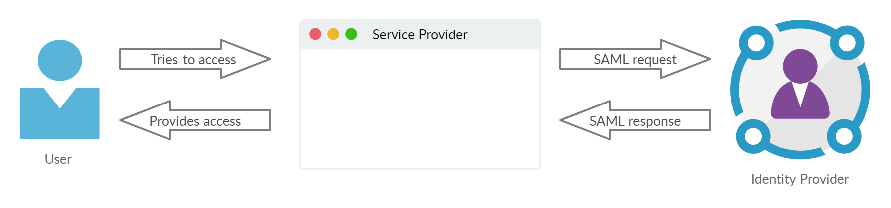

# SAML based Single Sign-on (SSO)

## What is Single Sign-on (SSO)?

If you have used your Google account to login with any other applications like Pinterest or Linkedin, then you are already familiar with SSO. 
Single Sign-on is an **authentication service** used to access multiple applications or services with a single set of credentials. 
There are two componenets in SSO. The first component is **Service Provider** (SP) which is the application or service you would like to access. The second component is **Identity Provider** (IdP)
which is the one that authenticates your access to the Service Provider. Think of Pinterest as the service provider and Google as the identity provider.  

## How SSO works?

When you try to access the service provider (Pinterest), it sends a request to the identity provider (Google) to authenticate your access. The identity provider verifies your credentials
(email address or username), and then sends back the response to the service provider. The service provider, on getting the respone saying your access is valid, logs you in and lets you use the services.  

If you are already logged in to your indentity provider (Google) in the current session, you won't have to enter your credentials. The identity provider verifies your identity automatically.

## What is SAML?

The interactions between service provider and identity provider are based on previously fixed arangements. The SP and IdP exchange information with each other through a standard
established at the time of configuration. There are several methods in which SP and IdP can interact. One of the methods is called **Secure Assertion Markup Language (SAML)**.  

SAML is a eXtensible Markup Language (XML) that lets the service provider send the request to the identity provider, and the identity provider to send back the response to the service provider. 
SAML is essentially the language through which both SP and IdP communicate. 

## SAML based SSO workflow

The following steps decribe a typical SAML based SSO workflow:  

- **Step 1**: The user tries to access a webpage or service.
- **Step 2**: The service provider generates an SAML request and sends it to the identity provider.
- **Step 3**: The identity provider receives the SAML request from the service provider.
- **Step 4**: The identity provider verifies the identity of the user with its own database.  
              (This step is skipped if the user is already logged into the identity provider.) 
- **Step 5**: The identity provider generates an SAML response and sends it to the service provider.
- **Step 6**: The service provider receives the SAML response.
- **Step 7**: If the SAML response is valid, then the service provider logs the user in and provides access to its services.  

## Advantages of SAML based SSO

1. Users don't have to remember multiple credentials to access multiple applications.
2. Organizations can maintain all the user credentials in a single database. 
3. Organizations can easily prevent a user from accessing any of their applications. 
4. The authentication process becomes more secure. 
